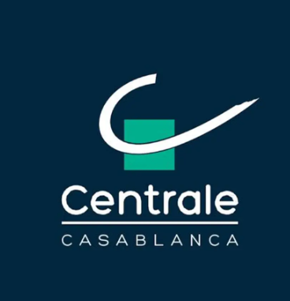
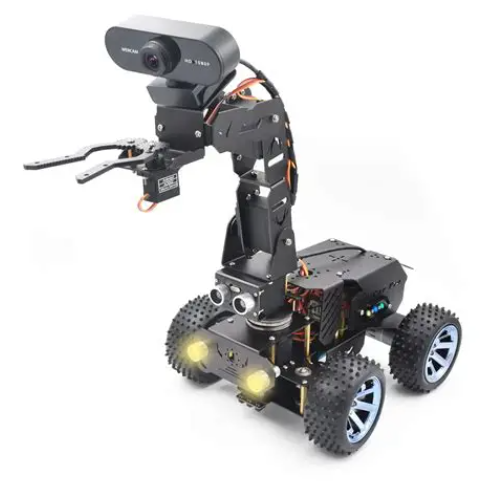
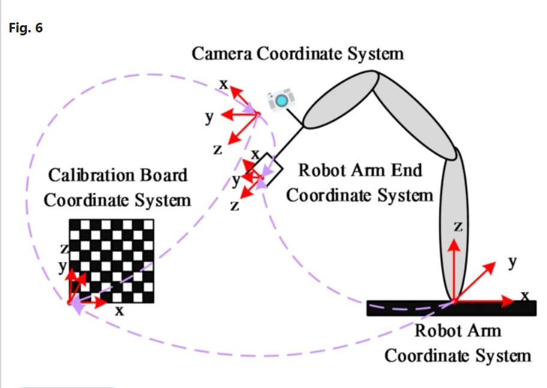
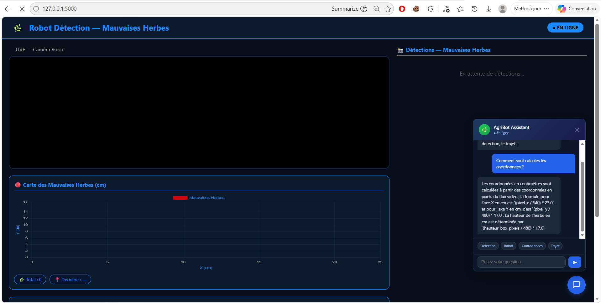

<table>
  <tr>
    <td>
      <h1>🌾 SPARK (Smart Pratics  Automatique Removal Kits)</h1>
      <blockquote>Détection automatique et élimination ciblée de mauvaises herbes par robot mobile via vision artificielle YOLOv8, asservissement visuel (IBVS) et application web Flask.</blockquote>
    </td>
    <td align="right" valign="top">
      
    </td>
  </tr>
</table>

---

## 👥 Équipe du Projet (PLBD 25)
* **Membres de l'équipe :** Zouhair Imad, Ilyas Dali, Fatima Ezzahra Melouki, Mohmed Chebabe, Inas Dridi
* **Encadrant :** Dr. Adil Ahidare
* **Institution :** École Centrale Casablanca
* **Année universitaire :** 2026
* **Cible marché :** Agriculteurs possédant des champs de tomates

---

## 🤖 Présentation Matérielle du Robot
Le robot SPARK s'appuie sur la plateforme matérielle **Adeept PiCar Pro V2 Smart Robot**. Il élimine la flore nuisible de manière ciblée grâce à une approche séquentielle en deux étapes :
1. **La détection :** Identification en temps réel via une caméra HD embarquée.
2. **L'action :** Élimination physique localisée de la mauvaise herbe à l'aide d'une pince montée sur son bras articulé.

  

---

## 📱 QR Code — Accès au Site Web

  
   
  <b>Scanner pour accéder au tableau de bord en direct</b>

---

## 📁 Architecture Logicielle du Répertoire

| Fichier / Répertoire | Description |
| :--- | :--- |
| `robot_client.py` | Code embarqué Raspberry Pi — capture vidéo, envoi des frames, gestion des moteurs et du buzzer. |
| `web_app_2.py` | Serveur central PC — Flask, exécution du modèle YOLOv8 en temps réel, streaming et interface utilisateur. |
| `yolov8n.pt` | Fichier de poids pré-entraînés YOLOv8 nano optimisé pour la détection des mauvaises herbes. |
| `train.py` | Script d'entraînement initial du modèle de vision artificielle (Roboflow dataset). |
| `templates/index.html` | Interface web de supervision — live stream, détections, graphe et panneau d'assistance. |
| `donnes_projet.json` | Base de connaissances et configuration dynamique lue par l'assistant virtuel. |

---

## ⚙️ Démarche Chronologique & Algorithmique du Trajet

### 🏁 Phase 1 : Initialisation et calibration
Avant d'effectuer le moindre mouvement, le robot configure l'ensemble de ses périphériques matériels :
* **Mise en position zéro :** Tous les servomoteurs (de 0 à 7) sont positionnés à leur angle neutre de 90°.
* **Extinction des actionneurs :** Tous les relais ou interrupteurs électroniques (`sw.set_all_switch_off()`) sont désactivés par sécurité.
* **Établissement des connexions :** Le Raspberry Pi ouvre un canal de communication TCP/IP (Socket) avec le PC distant (`PC_IP:9999`) et initialise le flux de sa caméra en résolution $640 \times 480$ pixels.

### 🛣️ Phase 2 : Exécution du parcours géométrique théorique
Une fois connecté, le robot lance son fil conducteur principal dans un thread séparé (`t_trajet`). Ce trajet est une boucle ouverte temporelle qui simule un parcours en "S" ou en boucle dans le champ de tomates :
* **Déploiement du bras (Position de travail) :** Le robot oriente son bras articulé vers le sol pour préparer la caméra embarquée à filmer la piste :
  * Le Servo 1 (axe horizontal) bascule à 145°.
  * Le Servo 2 (axe vertical) s'abaisse à 130°.
* **Premier segment rectiligne :** Le robot active ses moteurs de propulsion pour avancer de 75 cm.
* **Premier virage :** Les roues directrices s'orientent à gauche (Servo 0 à 45°) et le robot effectue une rotation continue pendant 19 secondes.
* **Deuxième segment rectiligne :** Le robot se remet en ligne droite et avance de 60 cm.
* **Deuxième virage :** Le robot tourne à nouveau à gauche pendant 19 secondes.
* **Troisième segment rectiligne :** Le robot avance de 70 cm pour terminer sa boucle.

### 👁️ Phase 3 : L'Interruption Prioritaire (Détection d'une mauvaise herbe)

Pendant que le robot avance sur les segments rectilignes de la Phase 2, une boucle d'écoute infinie surveille en continu le retour des analyses du modèle YOLOv8 envoyé par le PC. Si le PC renvoie des coordonnées valides (la plante est détectée), la démarche du robot change instantanément :

* 🚜 **[Robot en mouvement]**
  * 🔽 *Une mauvaise herbe est détectée !*
  * 🛑 **[Arrêt immédiat des moteurs]** → `move.motorStop()`
  * 🔄 **[Lancement de la boucle IBVS]** *(Thread parallèle)*
  * 🎯 **[Correction fine du bras]** → Ajustement itératif des servos 1, 2 et 3
  * 📉 **[Convergence]** → Erreur < 30 pixels
  * 🦾 **[Séquence d'arrachage physique]** → Ouverture/Fermeture des pinces + Outils
  * 👁️ **[Réactivation de la détection]**
  * 🔄 **[Reprise du trajet initial]** → Les moteurs redémarrent là où ils s'étaient arrêtés.
### 🛠️ Phase 4 : L'action mécanique d'élimination
Dès que l'erreur visuelle passe sous le seuil de tolérance requis ($SEUIL_X = 30$, $SEUIL_Y = 30$), la fonction `arracher()` prend le relais :
* **Alerte sonore :** Le buzzer émet un signal (note C4 pendant 1 seconde) pour notifier l'action.
* **Actionnement des pinces :** Le Servo 4 s'ouvre à 130° (ouverture des dents) puis se referme à 80° pour saisir l'herbe.
* **Activation de l'outil d'extraction :** Les interrupteurs électriques 1 et 2 (`sw.switch`) s'allument pendant 0,8 seconde pour alimenter l'outil physique d'élimination, puis se coupent.
* **Repli de sécurité :** Le bras se relève et se repositionne en configuration de sécurité pour ne pas racler le sol pendant le déplacement.
* **Signal de reprise :** Le robot envoie une requête HTTP `/activer_detection` à l'application web pour vider la mémoire de capture de l'écran, les moteurs redémarrent, et le robot reprend son trajet initial.

### 🏁 Phase 5 : Fin de mission
Une fois les distances théoriques épuisées (les 70 cm du dernier segment accomplis), le script appelle `position_initiale()` : les moteurs s'arrêtent définitivement, le bras se remet au repos complet (tous les servos à 90°) et le terminal affiche `"Mission terminee !"`.

---

## 📐 Le principe de l'Asservissement Visuel (IBVS)

Contrairement à un automatisme classique où l'on donnerait des coordonnées géométriques fixes, l'asservissement visuel utilise la caméra comme un **capteur de position en temps réel**. Le robot ajuste ses mouvements en fonction de ce qu'il voit à l'écran jusqu'à ce que l'image observée corresponde parfaitement à l'objectif visé.

### 🔄 La boucle de rétroaction appliquée au robot
Lorsque le robot intercepte une mauvaise herbe, il fige ses roues et engage la boucle de rétroaction visuelle (`boucle_ibvs`) pour amener l'outil d'arrachage pile au-dessus de la cible :

1. **Mesure de l'erreur en pixels :** Le programme connaît le centre idéal de l'image (qui correspond à l'alignement parfait de l'outil d'arrachage), soit $CX = 320$ et $CY = 240$ pixels. Dès que YOLOv8 détecte une herbe à une position ($cx, cy$), l'écart (l'erreur visuelle) est calculé :

$$\text{Erreur}_X = cx - 320$$

$$\text{Erreur}_Y = cy - 240$$

2. **Commande proportionnelle des servomoteurs :** Pour annuler cette erreur, le Raspberry Pi applique des gains qui traduisent l'écart en pixels en un angle de rotation pour les moteurs :
   * **Servo 1 (Axe Horizontal) :** Si l'herbe est trop à droite ($\text{Erreur}_X > 0$), l'angle du Servo 1 augmente proportionnellement pour faire pivoter le bras vers la droite.
   * **Servo 2 (Axe Vertical) :** Si l'herbe est trop basse sur l'image ($\text{Erreur}_Y > 0$), le Servo 2 s'abaisse pour rapprocher la caméra et l'outil du sol.
   * **Servo 3 (Profondeur) :** Il aide à ajuster l'extension du bras pour parfaire l'approche spatiale.

3. **Stabilisation et validation (Convergence) :** Le bras bouge légèrement, puis le robot **attend 0,6 seconde** pour que l'image ne soit pas floue. Il reprend une capture d'image, recalcule l'erreur, et ajuste à nouveau les servos. Ce cycle se répète jusqu'à un maximum de 15 fois jusqu'à ce que l'erreur devienne inférieure à 30 pixels.

  

---

## 🧠 Spécifications de l'Intelligence Artificielle (YOLOv8)

Nous avons choisi **YOLOv8**  pour notre architecture embarquée :

| Critère | YOLOv8 ✅ | 
| :--- | :--- | 
| **Stabilité** | Très stable, mature et optimisé. | 
| **Documentation** | Complète, grand catalogue de cas d'usage. | 
| **Support CPU** | Idéal pour l'inférence continue sur CPU local. | 
| **Compatibilité Pi** | Intégration matérielle testée et fluide. | 

### Métriques d'entraînement du modèle
* **Dataset :** Mauvaises herbes (Roboflow - Liseron des champs, Chénopode blanc)
* **Nombre d'Epochs :** 50
* **Taille d'image d'entrée :** $640 \times 640$ pixels
* **Seuil de confiance minimal :** 0.5
* **Score mAP50 :** 0.0306

---

## 🖥️ Tableau de Bord Web & Supervision Intelligente

L'application Flask gère l'interface web utilisateur et l'interaction globale avec le système.

  

### 🤖 L'Assistant Virtuel Intelligent (Chatbot AgriBot)
Intégré directement sur l'interface et relié à la route `/chat`, ce composant permet à l'opérateur ou au jury d'interagir en langage naturel :
* **Interface conversationnelle :** Zone de saisie fluide avec mémorisation de l'historique local.
* **Boutons de suggestions rapides (Quick Replies) :** Raccourcis en un clic (`Detection`, `Robot`, `Coordonnées`, `Trajet`).
* **Intelligence Artificielle contextuelle :** Propulsé par l'API **Gemini 2.5 Flash**, le chatbot est configuré pour agir comme l'expert technique de la solution. Il parcourt dynamiquement la base de données structurée du fichier `donnes_projet.json` pour renvoyer des réponses adaptées et professionnelles en français.

---

## 🎬 Simulation du Trajet du Robot

Aperçu dynamique du comportement cinématique et du suivi de trajectoire du robot SPARK lors de sa patrouille automatisée :

  

---

## 🔧 Spécifications Techniques Matérielles

| Composant | Détails et Rôle |
| :--- | :--- |
| **Châssis Robot** | Adeept PiCar Pro V2 |
| **Calculateur Embarqué** | Raspberry Pi 4B |
| **Capteur Optique** | Caméra HD USB (Résolution d'acquisition $640 \times 480$) |
| **Indicateur Sonore** | TonalBuzzer connecté au port GPIO 18 |
| **Station de Calcul** | PC Windows distant — Inférence YOLOv8 + Serveur Flask |
| **Réseau de communication** | Protocole WiFi TCP/IP sur le Port Unique `9999` |

---

## 👥 Équipe — Soutenance PLBD_25_

---