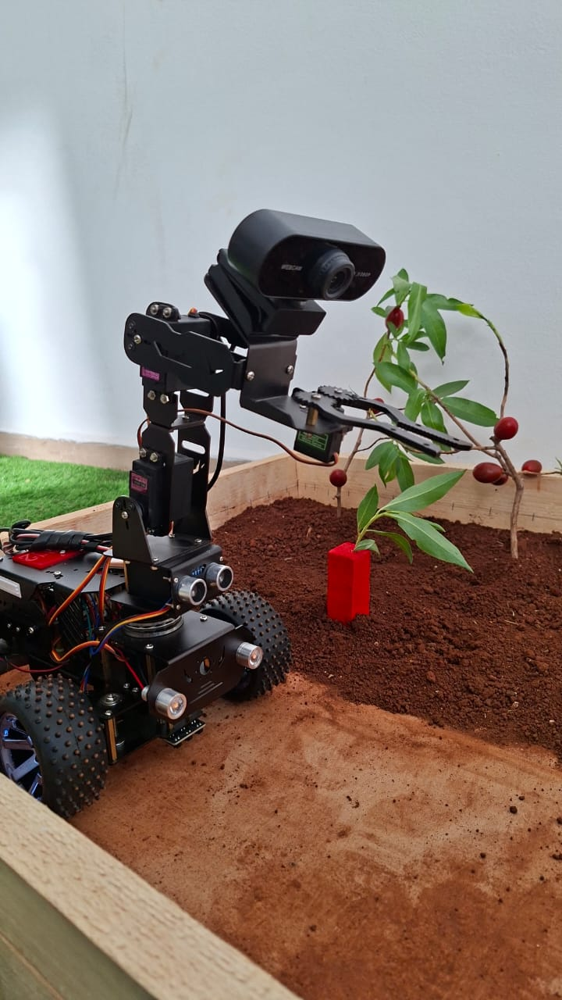

<table>
  <tr>
    <td>
      <h1>🌾 SPARK (Smart Plant Analysis Removal Kit)</h1>
      <blockquote>Détection automatique et élimination ciblée de mauvaises herbes par robot mobile via vision artificielle YOLOv8, asservissement visuel (IBVS) et application web Flask.</blockquote>
    </td>
    <td align="center" valign="middle">
      
    </td>
  </tr>
</table>

---

## 👥 Équipe du Projet (PLBD 25)
* **Membres de l'équipe :** Zouhair Imad, Ilyass Dali, Fatima Ezzahra Mlouki, Mohammed Chbab, Ines Dridi
* **Encadrant :** M. Adil Ahidar
* **Institution :** École Centrale Casablanca
* **Année universitaire :** 2026
* **Cible marché :** Agriculteurs possédant des champs de tomates

---

## 🤖 Présentation Matérielle du Robot
Le robot SPARK s'appuie sur la plateforme matérielle **Adeept PiCar Pro V2 Smart Robot**. Il élimine la flore nuisible de manière ciblée grâce à une approche séquentielle en deux étapes :
1. **La détection :** Identification en temps réel via une caméra HD embarquée.
2. **L'action :** Élimination physique localisée de la mauvaise herbe à l'aide d'une pince montée sur son bras articulé.

<p align="center">
  
</p>

---

## 📱 QR Code — Accès au Site Web

<p align="center">
  
  <br/>
  <b>Scanner pour accéder au tableau de bord en direct</b>
</p>

---

## 🌐 Architecture Réseau et Communication du Système

<p align="center">
  
  <br/>
  <b>Diagramme des flux d'échange de données en temps réel entre le Robot et le PC</b>
</p>

---

## 📁 Architecture Logicielle du Répertoire

| Fichier / Répertoire | Emplacement | Description |
| :--- | :--- | :--- |
| `robot_agri_34.py` | 🔴 Raspberry Pi (Robot) | Code embarqué principal : capture vidéo, envoi des frames au PC via socket TCP/IP, pilotage des moteurs de propulsion, du bras articulé (servomoteurs), des switches d'arrachage et du buzzer. Contient le scénario complet de patrouille, de centrage et d'arrachage. |
| `web_app_10.py` | 🖥️ PC (Station de calcul) | Serveur central **Flask** : réception des frames, exécution du modèle YOLOv8 en temps réel, streaming vidéo annoté, conversion pixels → cm, tableau de bord web, route GPS et chatbot Gemini. Sert la page `templates/index_10.html`. |
| `yolov8n.pt` | 🖥️ PC | Poids du modèle **YOLOv8 Nano** servant de base de transfert pour l'entraînement sur le jeu de données de mauvaises herbes. |
| `train.py` | 🖥️ PC | Script d'entraînement du modèle de vision (Ultralytics YOLOv8, dataset Roboflow, 50 epochs, image 640×640, CPU). Produit le modèle spécialisé `best.pt`. |
| `templates/index_10.html` | 🖥️ PC | Interface web de supervision : live stream, historique des détections, KPIs, graphes (carte des herbes + trajet rectiligne à 1 segment), carte GPS Leaflet, panneau de vérification d'arrachage et assistant conversationnel. |
| `donnes_projet.json` | 🖥️ PC | Base de connaissances structurée du projet, lue dynamiquement par l'assistant virtuel (Gemini) pour répondre de façon contextuelle. |
| `robot_test_recuperation_18.py` | 🔴 Raspberry Pi (Robot) | Script de **test/apprentissage de la récupération d'objet** : détection d'un objet repère par couleur (HSV), centrage horizontal du bras (Servo 1) puis séquence fixe de préhension. A servi à calibrer la cinématique de la pince avant l'intégration finale. |

> 🔢 **Lecture des numéros de version :** les chiffres dans les noms de fichiers correspondent au nombre d'essais réalisés sur chaque sous-système :
> * **34** → 34 essais pour l'action du robot (`robot_agri_34.py`)
> * **18** → 18 essais pour l'apprentissage de la récupération d'objet (`robot_test_recuperation_18.py`)
> * **10** → 10 essais pour le site et son interface (`web_app_10.py` / `index_10.html`)
>
> **Soit un total de 62 essais** menés jusqu'à la dernière version du système. 🚀

---

## ⚙️ Démarche Chronologique & Algorithmique du Trajet

Voici le scénario réel exécuté par le robot, tel qu'il est codé dans `robot_agri_34.py` :

```text
 1. Position de travail (Servo1 = 135°, Servo2 = 125°)
 2. Robot avance en continu (moteurs ON, vitesse 5)
 3. Caméra envoie les frames → le PC répond via YOLOv8

 ─── En attente de détection... ───

 4. DÉTECTION !  → Moteurs STOP
 5. ⛔ Modèle DÉSACTIVÉ (desherbage_actif = True)
 6. Pause 2 s

 7. CENTRAGE IBVS (repère couleur)
    → max 40 itérations × 0.5 s
    → ajuste Servo1 jusqu'à erreur < 30 px (3× confirmé)

 8. ARRACHAGE :
    • Servo4 → 130° (ouvre la pince) ............ 1 s
    • Servo2 → 170°, Servo3 → 130° (descend) .... 1.5 s
    • Servo4 → 70°  (ferme la pince) ............ 1 s
    • Switch 1 & 2 ON 0.8 s → OFF
    • Servo2 → 90°, Servo3 → 90° (remonte) ...... 1.5 s
    • Servo4 → 170° ............................. 2 s
    • Servo4 → 90° .............................. 2 s
    • Buzzer C4 🔔 .............................. 0.8 s

 9. Bras → position de travail (S1 = 135°, S2 = 125°)
10. 📸 Capture photo → envoi au PC (/save_verification)
11. Pause 2 s

12. POSITION INITIALE (tous les servos à 90°, moteurs OFF)
13. Pause 1 s

14. ⏳ ATTENTE 15 s (modèle toujours désactivé : aucune détection
    pendant cette période, rien à voir dans le live)

15. Retour à l'état initial → ✅ Modèle RÉACTIVÉ (desherbage_actif = False)
16. Envoi de /activer_detection au PC → nouveau cycle
```

### 🛣️ Le trajet rectiligne et son modèle temporel

Le robot parcourt une **trajectoire rectiligne unique** (un seul segment, cohérent avec `robot_agri_34.py` et l'affichage « Trajet estimé » de l'interface). Il avance à une vitesse de croisière de **1,6 cm/s**.

> 💡 **Oui, cette vitesse est volontairement faible.** C'est le résultat de nombreux essais successifs : nous avons cherché expérimentalement la **bonne vitesse** qui garantit à la fois une **détection fiable** des mauvaises herbes et un **arrachage précis** par le bras. Une vitesse plus élevée dégradait la qualité de la détection et le centrage de l'outil.

Le temps total mis par le robot pour parcourir une distance **d** se décompose en deux contributions :

$$T(d, N) = t_0 + t_1 = \frac{d}{v} + \sum_{i=1}^{N} \tau_i \approx \frac{d}{v} + N \cdot \bar{\tau}$$

où :
* **t₀ = d / v** : le temps de déplacement « pur », sans détection de mauvaise herbe (v = 1,6 cm/s) ;
* **t₁ = N · τ̄** : le temps cumulé des interventions, avec **N** le nombre de mauvaises herbes rencontrées et **τ̄** la durée moyenne d'une intervention complète (arrêt + centrage IBVS + arrachage + vérification + attente de 15 s + réactivation).

À partir des temporisations du code, une intervention dure :

$$\bar{\tau} \approx \underbrace{2}_{\text{pause}} + \underbrace{t_{\text{centrage}}}_{\le\,20\,\text{s}} + \underbrace{10{,}6}_{\text{arrachage}} + \underbrace{3}_{\text{vérif.}} + \underbrace{1}_{\text{init.}} + \underbrace{15}_{\text{attente}} \;\approx\; 40\ \text{s}$$

#### 📐 Exemple concret
Pour un segment de **d = 205 cm** avec **N = 3** mauvaises herbes détectées :

* t₀ = 205 / 1,6 ≈ **128 s** (≈ 2 min 08 s)
* t₁ = 3 × 40 ≈ **120 s** (≈ 2 min 00 s)
* **T ≈ 248 s ≈ 4 min 08 s**

Le robot boucle ainsi son parcours dans l'enveloppe de la mission (7 minutes) tout en traitant chaque mauvaise herbe rencontrée.

<p align="center">
  
  <br/>
  <b>Simulation du comportement cinématique du robot SPARK sur sa trajectoire</b>
</p>

---

## 📐 L'Asservissement Visuel (IBVS) — base de la prise de la cible

Une fois la mauvaise herbe **détectée** et la photo d'analyse **encadrée en rouge** (capture automatique), c'est à **cette étape que le calcul de l'IBVS commence**. L'objectif n'est pas de « ramasser un objet » : l'IBVS sert à amener l'outil d'arrachage exactement sur le **centre de masse de la mauvaise herbe**, situé entre sa **partie inférieure** (près des racines) et sa **partie supérieure** (près de la feuille principale). C'est ce point d'équilibre qui assure un arrachage net, à la racine.

### 🔄 Les relations mathématiques essentielles

**1. Centre de masse de la cible.** À partir des moments de l'image, le centroïde de la zone détectée est :

$$c_x = \frac{m_{10}}{m_{00}}, \qquad c_y = \frac{m_{01}}{m_{00}}$$

Ce centroïde correspond au centre de masse entre les racines (bas) et la feuille principale (haut).

**2. Erreur visuelle (en pixels).** Le centre idéal de l'image (alignement parfait de l'outil) est $C_x = 320$, $C_y = 240$ :

$$e_x = c_x - C_x$$

**3. Loi de commande proportionnelle (IBVS scalaire).** L'angle du servomoteur horizontal est corrigé proportionnellement à l'erreur, puis borné :

$$\theta_{S1}(k+1) = \mathrm{clamp}\Big(\theta_{S1}(k) - K_p \cdot e_x,\; 40°,\; 180°\Big), \qquad K_p = 0{,}08$$

Cette loi est la forme simplifiée à un degré de liberté de l'asservissement visuel basé image :

$$\dot{q} = -\lambda \, L_s^{+} \, (s - s^{*})$$

où $s$ est la primitive visuelle observée (la position du centre de masse), $s^{*}$ la position désirée (le centre de l'image) et $\lambda$ le gain.

**4. Convergence.** Le bras s'ajuste, attend la stabilisation de l'image, puis recalcule. Le cycle se répète (jusqu'à 40 itérations de 0,5 s) jusqu'à ce que l'erreur soit confirmée **inférieure à 30 pixels sur 3 mesures consécutives**.

<p align="center">
  
  <br/>
  <b>Résultats de l'exécution de l'IBVS sur le Raspberry Pi</b>
</p>

### 🧠 Pourquoi YOLOv8 ?

| Critère | YOLOv8 ✅ |
| :--- | :--- |
| **Stabilité** | Très stable, mature et optimisé. |
| **Documentation** | Complète, grand catalogue de cas d'usage. |
| **Support CPU** | Idéal pour l'inférence continue sur CPU local. |
| **Compatibilité Pi** | Intégration matérielle testée et fluide. |

### 🔁 Chaîne de traitement complète

<table>
  <tr>
    <td align="center" width="25%"><b>1️⃣ Détection (live)</b></td>
    <td align="center" width="25%"><b>2️⃣ Capture automatique<br/>(encadrée en rouge)</b></td>
    <td align="center" width="25%"><b>3️⃣ Action IBVS<br/>+ arrachage</b></td>
    <td align="center" width="25%"><b>4️⃣ Vérification<br/>d'arrachage</b></td>
  </tr>
  <tr>
    <td align="center"></td>
    <td align="center"></td>
    <td align="center">⚙️🦾<br/><br/>Centrage du bras sur le<br/>centre de masse de la cible,<br/>puis arrachage à la racine.</td>
    <td align="center"></td>
  </tr>
</table>

<p align="center">
  <b>Détection</b> ➡️ <b>Capture (encadrée rouge)</b> ➡️ <b>Action IBVS</b> ➡️ <b>Vérification</b>
</p>

---

## 🖥️ Tableau de Bord Web & Supervision Intelligente

L'application Flask (`web_app_10.py`) sert une interface de supervision moderne qui va **bien au-delà de la simple détection**.

<p align="center">
  
  <br/>
  
  <br/>
  
</p>

L'interface regroupe le **flux vidéo annoté en direct**, l'**historique des détections** (coordonnées en cm, confiance, captures), des **KPIs** et des **graphes**, ainsi que deux modules clés :

### 🤖 L'Assistant Virtuel Intelligent (Chatbot AgriBot)
Relié à la route `/chat`, le chatbot permet à l'opérateur ou au jury d'interagir en langage naturel :
* **Base de connaissances :** il s'appuie sur le fichier structuré **`donnes_projet.json`** pour ne répondre qu'avec les données réelles du projet.
* **Moteur d'IA :** propulsé par l'API **Gemini Flash 2.5**, configuré pour agir comme l'expert technique de la solution et répondre en français de façon concise et professionnelle.

### 📍 Localisation GPS en temps réel
Le robot embarque un **capteur de position : le module GPS NEO-M8N**. Ce module lit en continu sa position et l'envoie au PC, qui la positionne précisément sur la carte (Leaflet) de l'interface.

Vérification simple de la présence du module GPS côté Raspberry Pi :

```python
import serial

avec = serial.Serial("/dev/ttyS0", baudrate=9600, timeout=1)
print("GPS Détecté :" if "$" in avec.readline().decode(errors="ignore") else "Non détecté")
```

Le module communique sur le port série `/dev/ttyS0` (9600 bauds) et émet des trames NMEA (commençant par `$`) que le robot transmet au PC pour un positionnement fidèle sur la carte.

---

## 🎬 Prototype & Résultats

Démonstrations vidéo du système SPARK en fonctionnement :

### 🦾 Arrachage de la mauvaise herbe

https://github.com/Zouhair-hub1/projet-plbd-25-ecc/raw/main/images/arrachage.mp4

▶️ [Ouvrir la vidéo d'arrachage](https://github.com/Zouhair-hub1/projet-plbd-25-ecc/raw/main/images/arrachage.mp4)

### 🌐 Interface web en action

https://github.com/Zouhair-hub1/projet-plbd-25-ecc/raw/main/images/interface%20web.mp4

▶️ [Ouvrir la vidéo de l'interface web](https://github.com/Zouhair-hub1/projet-plbd-25-ecc/raw/main/images/interface%20web.mp4)

---

## 🔧 Spécifications Techniques Matérielles

| Composant | Détails et Rôle |
| :--- | :--- |
| **Châssis Robot** | Adeept PiCar Pro V2 |
| **Calculateur Embarqué** | Raspberry Pi 4B |
| **Capteur Optique** | Caméra HD USB (Résolution d'acquisition $640 \times 480$) |
| **Capteur de Position** | Module GPS NEO-M8N (port série `/dev/ttyS0`, 9600 bauds) |
| **Bras articulé** | 4 servomoteurs (Servo 1 à 4) + pince/dents d'arrachage |
| **Indicateur Sonore** | TonalBuzzer connecté au GPIO 18 |
| **Station de Calcul** | PC distant — Inférence YOLOv8 + Serveur Flask |
| **Réseau de communication** | Protocole WiFi TCP/IP sur le Port `9999` (socket) + Flask sur le port `5000` |

---

## 👥 Équipe — Soutenance PLBD_25_
